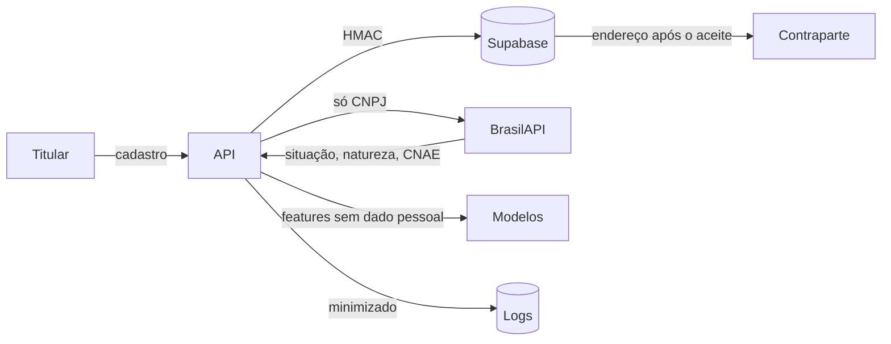

# Inventário de dados (registro das operações de tratamento, LGPD art. 37)

> Fonte única por coluna: [`src/governanca/catalogo.py`](../../src/governanca/catalogo.py). O teste `tests/test_governanca.py` quebra se um arquivo de dados tiver uma coluna sem classificação. Este documento resume as **operações de tratamento**.

## 1. Classes de dado

| Classe | Definição | Exemplos | Proteção |
|---|---|---|---|
| **Pública** | Fonte pública de referência | Setores censitários, IPVS 2022 | Integridade (SHA-256 do download) |
| **Interna** | Operacional, não identifica pessoa | Categoria, peso, prioridade, tempos | Controle de acesso por perfil |
| **Pessoal pseudonimizada** | Identifica indiretamente | IDs, HMAC do documento, localização de PF (centroide do setor) | HMAC com chave no cofre; nunca vai para modelo |
| **Pessoal potencial** | Texto livre digitado pelo usuário | Descrição do lote | Guardrail; mascaramento; 90 dias; fora dos logs |
| *Pessoal direto* | Nome, documento em claro, e-mail, telefone, endereço exato | Só no cadastro da API (CP3) | Supabase com RLS; nunca nos logs nem nos modelos |
| *Sensível (art. 5º, II)* | Saúde, religião, etnia… | **Não coletado** | — |

## 2. Operações de tratamento

| Operação | Dados | Finalidade | Base legal (art. 7º) | Retenção | Compartilhamento |
|---|---|---|---|---|---|
| Cadastro de doador e ONG | Nome, documento, contato, endereço | Identificar as partes e viabilizar a doação | V: execução de contrato / procedimentos preliminares | 12 meses após a última atividade, depois anonimizado | Endereço só para a contraparte, **após o aceite** |
| Verificação de CNPJ | CNPJ | Prevenir ONG de fachada e fraude | IX: legítimo interesse (prevenção a fraude) | Igual ao cadastro | BrasilAPI (só o CNPJ; da resposta guardamos só situação, natureza e CNAE) |
| Cadastro de lote e questionário | Descrição, categoria, peso, datas, respostas | Segurança alimentar e matching | V | Lote: 5 anos (auditoria) · texto livre: 90 dias | ONG que aceitou (categoria, alergênicos, validade) |
| Declaração de Doação | Pseudônimo do doador + dados do lote | Prova das condições do alimento (Lei 14.016) | VI: exercício regular de direitos | 5 anos | Auditor, mediante solicitação |
| Matching, transporte e caixa | IDs, tempos, valores | Operar a doação e o caixa solidário | V | 5 anos | Transportador: endereço após o aceite |
| Modelos de IA | Features sem dado pessoal | Priorizar e prever descarte | IX: legítimo interesse (melhoria do serviço) | Dataset de treino versionado | Nenhum |
| Logs e observabilidade | Pseudônimos, ações, resultados | Segurança, auditoria, detecção de abuso | IX + VI | 90 dias (operacional) · 5 anos (auditoria) | Nenhum |

## 3. Fluxo de dados pessoais

