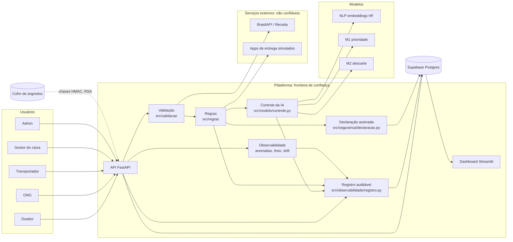
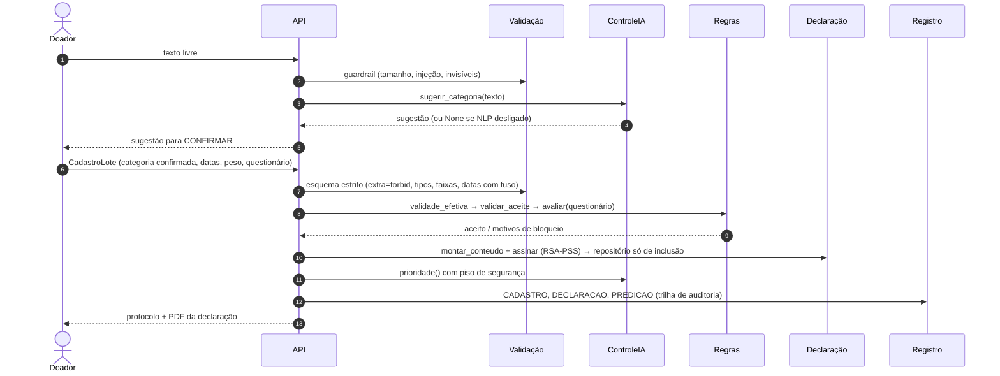
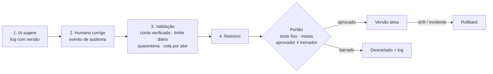

# SDD: Rede Alimenta IA

> **Software Design Document** · v2.0 · 2026-10-05
> O **como**. Requisitos em [PRD](prd.md); regras em [regras-de-negocio.md](regras-de-negocio.md); ameaças em [STRIDE](stride/matriz-stride.md).

---

## 1. Princípios de arquitetura

| Princípio | Decisão concreta |
|---|---|
| A IA recomenda, a regra decide | Toda chamada de modelo passa por `ControleIA`, que só devolve `Recomendacao`. Nenhum modelo grava, paga ou aciona transporte |
| Autorização fora do modelo | Tetos, validade mínima, filtros de ONG e permissões estão em `src/regras/`, código puro e testado |
| Entrada não confiável | Validação em 5 camadas antes de qualquer dado ser considerado (regras 4.6) |
| Uma fonte de verdade por regra | Simulação, API e testes importam as **mesmas** funções de `src/regras/` |
| Falha fechada | Serviço externo indisponível → pendente de revisão, nunca aprovado por omissão |
| Evidência por padrão | Todo controle tem teste; toda decisão tem registro auditável |

## 2. Visão geral

## 3. Módulos do código

| Pacote | Responsabilidade | Depende de |
|---|---|---|
| `src/regras/` | Regras de negócio puras: validade, prioridade, logística, questionário, cadastro, refeições | nada (só stdlib) |
| `src/validacao/` | Esquemas de entrada (Pydantic estrito), dígito verificador, verificação na Receita | `regras` |
| `src/seguranca/` | Guardrail de texto, minimização/pseudônimo, segredos, Declaração (RSA-PSS) + PDF, STRIDE | `regras` |
| `src/observabilidade/` | Registro auditável (2 trilhas, cadeia HMAC), anomalias (linha de base), freio, drift (PSI) | `seguranca` |
| `src/models/` | Features (controle de vazamento), treino, NLP, artefatos com hash, **controle da IA**, **feedback** | `regras`, `observabilidade` |
| `src/governanca/` | Catálogo de dados (classe, base legal, retenção, dono), qualidade de dados | `validacao` |
| `src/data/` | Curadoria IPVS, premissas, entidades, simulação do processo, gerador | `regras` |

> As regras não dependem de nada. É por isso que a mesma função que decide na API também gera o dataset e é testada isoladamente.

## 4. Fluxos principais

### 4.1 Cadastro de lote

### 4.2 Matching e transporte

1. **Filtros obrigatórios** (`motivo_incompatibilidade`, capacidade, raio, disponibilidade, rota expressa). O motivo de exclusão de cada ONG vai para o log.
2. **Score** (`score_ong`): acesso, capacidade, vulnerabilidade, turno; complementaridade e pedido multiplicados pelo acesso.
3. Oferta sequencial com prazo por prioridade; após 3 falhas, escala ao admin.
4. Transporte em cascata: gratuitos primeiro. O pago só entra com espera estourada **e** M2 (via `ControleIA.risco_descarte`) indicando risco alto.
5. Caixa: até o teto a ONG confirma; acima dele, o gestor externo aprova.

### 4.3 Ciclo de feedback (RLHF adaptado)

## 5. Dados

| Entidade | Chave | Observação |
|---|---|---|
| Doador | `doador_id` | Documento só como HMAC; PF no centroide do setor |
| ONG | `ong_id` | Capacidades, janela, categorias aceitas, status de aprovação |
| Lote | `lote_id` | Cadastro, validade calculada, questionário, prioridade, desfecho |
| Declaração | `declaracao_id` + versão | JSON canônico assinado; versões encadeadas por hash |
| Pedido | `pedido_id` | Categoria, kg, validade, kg atendido |
| Evento | `evento_id` | Trilha do processo de cada lote |
| Registro auditável | `evento_id` + `hash` | Cadeia HMAC; 90 dias / 5 anos |

Classificação, base legal, retenção e dono de **cada coluna**: `src/governanca/catalogo.py` (verificado por teste).

## 6. Segurança por camada (aula 6: seis camadas)

| Camada | Controles implementados |
|---|---|
| Governança | Regras versionadas; política de IA; RACI; registro de riscos; portão de promoção com segregação |
| Dados | Minimização, HMAC, catálogo verificado por teste, qualidade de dados, retenção |
| Modelo | Artefato com SHA-256, modelos HF fixados por commit e só em safetensors, piso de segurança, drift |
| Aplicação | Validação em 5 camadas, guardrail, declaração assinada, log à prova de adulteração |
| Ferramentas/agentes | IA sem agência (só recomenda); integrações externas tratadas como não confiáveis, com falha fechada |
| Infraestrutura | CP2: imagem Docker mínima, Bandit + Trivy, segredos fora do repositório, menor privilégio no Supabase (RLS) |

## 7. Decisões de projeto (resumo)

| # | Decisão | Alternativa descartada | Motivo |
|---|---|---|---|
| D1 | Validade **calculada** pelo sistema | Validade digitada | Entrada não confiável (STRIDE T1) |
| D2 | NLP por **similaridade de embeddings** | Zero-shot NLI | 75% vs. 50% de acurácia, 4,4 ms vs. 3,8 s (dataset v2.0) |
| D3 | Cadeia de log com **HMAC** | SHA-256 puro | Quem escreve no arquivo sem a chave não recalcula a cadeia |
| D4 | Declaração assinada com **RSA-PSS** | Só hash | Hash prova integridade, mas não a origem; assinatura prova as duas |
| D5 | Linha de base com **mediana/MAD** | Média/desvio-padrão | Robusta às próprias anomalias |
| D6 | Complementaridade **× acesso** | Peso aditivo | Aditivo custava 1 p.p. de descarte (calibração) |
| D7 | RLHF adaptado a **feedback validado + portão** | RLHF clássico (PPO) | Não há LLM; o risco central é o envenenamento do feedback |
| D8 | Esquema com **extra=forbid + strict** | Validação permissiva | Impede campo injetado (`"aprovado": true`) e conversão silenciosa |

## 8. Implantação (CP2/CP3)

- **Docker**: imagem slim, usuário sem privilégios, modelos verificados por hash no start.
- **GitHub Actions**: pytest → qualidade de dados → Bandit → Trivy → build. O gate falha em achado ALTO/CRÍTICO.
- **Render / HF Spaces**: API e dashboard; Supabase gerenciado com RLS.
- **Segredos** (`REDE_ALIMENTA_*`): HMAC de documento, pseudônimo e log; chave RSA da declaração. Em produção (`REDE_ALIMENTA_AMBIENTE=producao`) a aplicação **não sobe** sem eles.

## 9. Rastreabilidade: requisito → código → teste

| Requisito | Código | Teste |
|---|---|---|
| RF-02 validade calculada | `src/regras/validade.py` | `tests/test_regras.py` |
| RF-03 PF só lacrado | `src/regras/logistica.py::pode_doar`, `questionario.py` | `test_regras.py`, `test_questionario.py` |
| RF-04 declaração | `src/seguranca/declaracao.py`, `declaracao_pdf.py` | `tests/seguranca/test_declaracao.py` |
| RF-05 validação | `src/validacao/esquemas.py` | `tests/validacao/test_esquemas.py` |
| RF-06 CNPJ | `src/validacao/documentos.py`, `receita.py` | `tests/validacao/test_documentos.py`, `test_receita.py` |
| RF-08/09/11 ranking | `src/regras/logistica.py` | `tests/test_regras.py` |
| RNF-03 logs | `src/observabilidade/registro.py` | `tests/observabilidade/test_registro.py` |
| RNF-04 observabilidade | `anomalias.py`, `freio.py`, `drift.py` | `tests/observabilidade/test_anomalias.py` |
| RNF-05 controle da IA | `src/models/controle.py` | `tests/models/test_controle.py` |
| RNF-06 feedback | `src/models/feedback.py` | `tests/models/test_feedback.py` |
| RNF-02 governança | `src/governanca/` | `tests/test_governanca.py` |
