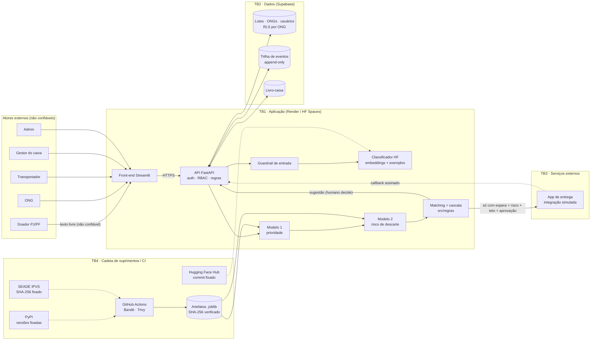

# Matriz de Ameaças e Riscos (STRIDE): Rede Alimenta IA

> **Entregável do Checkpoint 1.** Modelagem de ameaças da **arquitetura-alvo** (como o sistema vai rodar em produção), feita **antes** de construir API, banco e deploy, como manda o *threat modeling*.
> Controles já implementados apontam para a **evidência** no repositório; os futuros estão marcados como *planejado CP2/CP3*.
>
> - Planilha completa (21 colunas, com cores): [`matriz-stride.xlsx`](matriz-stride.xlsx)
> - Tabela resumida: [`matriz-stride-tabela.md`](matriz-stride-tabela.md)
> - Fonte única dos dados: [`src/seguranca/stride.py`](../../src/seguranca/stride.py). Gerar de novo com `python -m src.seguranca.stride`.

---

## 1. Metodologia

Cada ameaça segue o vocabulário das aulas de Cibersegurança em IA:

**Ativo → Ameaça → Vulnerabilidade → Impacto → Controle → Evidência → Reteste**

| Elemento | Como aparece na matriz |
|---|---|
| **Categoria STRIDE** | **S**poofing · **T**ampering · **R**epudiation · **I**nformation Disclosure · **D**enial of Service · **E**levation of Privilege |
| **Princípio afetado** | Confidencialidade, Integridade, Disponibilidade, Privacidade ou Governança |
| **Referência** | OWASP Top 10 for LLM Applications (LLM01–LLM10), OWASP API Top 10, MITRE ATLAS, MITRE ATT&CK, LGPD |
| **Risco** | **Probabilidade (1–5) × Impacto (1–5)** |
| **Inerente × Residual** | Inerente = sem controles · Residual = com os controles listados |
| **Controles** | **Preventivo** (evita) · **Detectivo** (percebe) · **Corretivo** (recupera) |
| **Evidência** | Arquivo, teste ou relatório no repositório que prova o controle |

**Faixas de risco (matriz 5×5, ISO 31000/27005):**

| P×I | Nível | Tratamento |
|---|---|---|
| 16–25 | 🔴 Crítico | Bloqueia o lançamento até mitigar |
| 10–15 | 🟠 Alto | Controle obrigatório antes do lançamento |
| 5–9 | 🟡 Médio | Plano de tratamento com prazo |
| 1–4 | 🟢 Baixo | Aceite documentado e monitoramento |

---

## 2. Diagrama de fluxo de dados (DFD) e fronteiras de confiança

| Fronteira | O que atravessa | Principal preocupação |
|---|---|---|
| **TB1** Internet → aplicação | Cadastros, texto livre, aceites, aprovações | Spoofing, injeção, abuso de recursos |
| **TB2** Aplicação → banco | Dados pessoais, lotes, caixa, eventos | Vazamento, IDOR, adulteração de registros |
| **TB3** Aplicação → app de entrega | Pedido pago, confirmação | Callback falso, gasto indevido |
| **TB4** Cadeia de suprimentos e CI | Dependências, modelo HF, dados SEADE, artefatos | Componente adulterado, código malicioso no deploy |

---

## 3. Resultado

> **v2.0 (2026-10-05):** 7 ameaças novas (S5, T7, T8, T9, I7, D5, E6) vindas das regras v2.0, e 12 ameaças com o controle agora implementado e testado (S1, T1, T2, R1, R2, I5, D1, D2, E2, E4, …).

| Nível | Inerente | Residual |
|---|---|---|
| 🔴 Crítico | **3** | **0** |
| 🟠 Alto | **15** | **0** |
| 🟡 Médio | 15 | 9 |
| 🟢 Baixo | 1 | 25 |
| **Total** | **34** | **34** |

Distribuição por categoria: Tampering 9 · Information Disclosure 7 · Elevation of Privilege 6 · Spoofing 5 · Denial of Service 5 · Repudiation 2.

### 3.1 As três ameaças críticas

| ID | Ameaça | Inerente | Controle principal | Residual |
|---|---|---|---|---|
| **S1** | ONG de fachada desvia alimentos e dinheiro do caixa | 4×5 = 20 🔴 | **Dígito verificador + consulta à Receita** (ativa, sem fins lucrativos) + **aprovação manual do Admin**; só ONG aprovada usa o caixa | 2×4 = 8 🟡 |
| **T1** | Doador informa validade falsa (ex.: marmita vencida) | 4×5 = 20 🔴 | **Validade calculada pelo sistema**; **questionário + declaração assinada**; inspeção na entrega | 2×4 = 8 🟡 |
| **E6** | Cliente injeta campos (`"aprovado": true`) ou tipos trocados para pular regras | 4×4 = 16 🔴 | **Esquemas estritos** (`extra=forbid`, sem conversão de tipo, listas fechadas, faixas) | 1×3 = 3 🟢 |

S1 e T1 continuam **médias**, não baixas, de propósito. A Receita prova que o CNPJ está ativo, mas uma fachada pode ter CNPJ ativo. E quem mente no questionário ou na hora do preparo ainda consegue passar. O risco residual fica **aceito e monitorado**: inspeção na entrega, reincidência por doador, pedidos × recebimentos por ONG (linha de base). Há uma diferença em relação à v1.1: agora existe a **declaração assinada**, que transforma a mentira em responsabilidade documentada.

### 3.2 Riscos residuais médios (plano de tratamento)

| ID | Por que continua médio | Tratamento previsto |
|---|---|---|
| S1, T1 | Ver acima | Monitoramento + reputação |
| S2 | Roubo de carga por falso transportador | PIN de coleta (CP3) |
| S3 | Phishing de ONG/gestor | MFA + sessão curta (CP3) |
| T3, T4 | Impacto máximo se ocorrer (execução de código / supply chain) | Hash verificado (feito) + Trivy no CI (CP2) |
| T6 | KPIs inflados | Confirmação dupla + append-only (CP3) |
| I4 | Vazamento de segredo teria impacto total | Secret scanning no CI (CP2) |
| D3 | Free tier pode dormir | Keep-alive + fallback de refrigeração (CP3) |

---

## 4. Evidência e reteste: prompt injection (E1)

Aplicação do ciclo de pentest da aula 9: **hipótese → execução → evidência → mitigação → reteste**.

| Versão | Payloads do dataset (388) | Inéditos A (10) | Inéditos B (10, **reservado**) | Falsos positivos (benignos) |
|---|---|---|---|---|
| **v1** | 100% | 2/10 | 3/10 | 1/10 |
| **v2** (normalização + padrões generalizados de A) | 100% | 10/10 | **4/10** | 0/10 |

- O conjunto **B nunca foi usado para ajustar o filtro**. Ele mede a generalização real.
- **Conclusão:** filtro por padrões generaliza mal (de 3 para 4 de 10). Isso confirma na prática o que as aulas ensinam: *prompt não é controle de segurança* e *a autorização deve existir fora do modelo*.
- **Por que o risco residual é baixo mesmo assim (3×1 = 3):** o classificador **só escolhe um rótulo de uma lista fixa** e não executa nada. O doador **confirma** a sugestão e as **regras no código** revalidam tudo. Na pior hipótese, um ataque que passa gera uma categoria sugerida errada, que é visível e corrigível.
- Evidência: [`reports/avaliacao_nlp.json`](../../reports/avaliacao_nlp.json), [`tests/seguranca/`](../../tests/seguranca/).

---

## 5. Riscos de IA fora do STRIDE

O STRIDE cobre ameaças de segurança. Os riscos **éticos e operacionais** de IA (aula 4) ficam na aba "Riscos de IA" da planilha:

| ID | Risco | Controle |
|---|---|---|
| A1 | **Viés geográfico** no ranking concentra doações | Vulnerabilidade por setor (IPVS) no score; monitorar kg por região; revisão dos pesos |
| A2 | **Drift** do Modelo 2 | Retreino periódico com split temporal; monitorar recall/precisão; rollback |
| A3 | **Confiança excessiva** na IA | IA só recomenda; justificativa visível; humano decide ações de impacto |
| A4 | **Eficiência logística × comida perdida** | Complementaridade multiplicada pelo acesso (custo medido: ~0,2 p.p. de descarte) |
| A5 | **Fadiga de alertas** | Três níveis; só alerta quando o nível sobe; sinais de negócio não bloqueiam |

---

## 6. Ligação com os frameworks das aulas

| Framework | Onde aparece |
|---|---|
| **OWASP Top 10 for LLM** | LLM01 (E1), LLM02 (I1, I5), LLM03 (T3, T4), LLM04 (T2, T9), LLM05 (E4, S5), LLM06 (E2, D4), LLM10 (D1) |
| **OWASP API** | API1 BOLA (I2), API3 BOPLA (E6), API5 BFLA (E3) |
| **MITRE ATLAS** | AML.T0051 (E1), AML.T0020 (T2, T9), AML.T0010 (T3, T4), AML.T0024/T0040 (I3), AML.T0029 (D1) |
| **MITRE ATT&CK** | T1566 (S3), T1070 (T8), T1195 (E5) |
| **NIST AI RMF** | *Governar*: regras e papéis (§3, §9) · *Mapear*: esta matriz · *Medir*: métricas e reteste · *Gerenciar*: tratamento dos residuais |
| **Modelo 5C** (aula 7) | Contexto: texto livre = dado (E1) · Credenciais: MFA/RBAC (S3, E3) · Capacidades: IA só recomenda (E2) · Controles: logs, hashes, testes (R1, T3) · Consciência: humano aprova gasto (D4, E2) |
| **Zero Trust** | Autorização por ONG (RLS), verificação contínua de integridade dos modelos (T3), segredos fora do código (I4) |
| **LGPD** | Minimização, HMAC de documentos, retenção, resposta a incidentes (I1, I5) |
